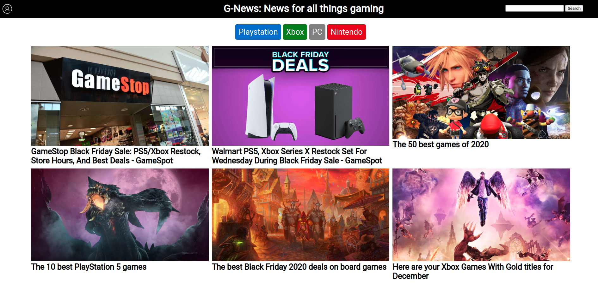

# G-NEWS: NEWS FOR ALL THINGS GAMING

### CLICK HERE: https://g-news.herokuapp.com/

1. SUMMARY 

G-News is a news platform focusing on gaming related news, with an account feature that allows unique users to customize their news feed. There is a discussions page feature that is a Work In Progress.

2. DEVELOPMENT

G-News is a CRUD app, a full-stack application that deals with Creating, Reading, Updating and Deleting records within the application.

Technologies used: Ruby, Sinatra, erb (HTML), PostgreSQL, SQL, BCrypt. 

The main structure of the web application is made with Sinatra. The news displayed on the application is taken from api requests to IGN.com, Polygon.com and Gamespot.com using HTTParty.

A database is created using PostgreSQL to store user data, accessed with the PG gem library, and requests are made with SQL commands. For security reasons, the passwords are encrypted using BCrypt. 

I started off by looking at different APIs to get the information needed to be displayed. I ended up using the NewsAPI as it seemed comprehensive and the data is in JSON format. 

Afterwards, I set up the erb files to structure the general layout of all the pages. Following that, I built the database and wrote the SQL commands to create, read, update and delete information to it.

I finished off with working on the aesthetics of the pages, using CSS grids for better symetry.

3. WORK IN PROGRESS/FUTURE WORKS

- Started on a discussions page where users can start a discussion on a specific news article, currently in early stages.
- mobile-friendly resizing.

4. LESSONS LEARNED

Working with various ruby gems was great, and allows quick prototyping of a full-stack web application with relative ease, especially Sinatra with ruby.

One of the big lessons learned with this project is that not all APIs are created equal, some lack a fair bit of information and some have poor documentation, therefore it's important to look into APIs appropriately before committing to them.

